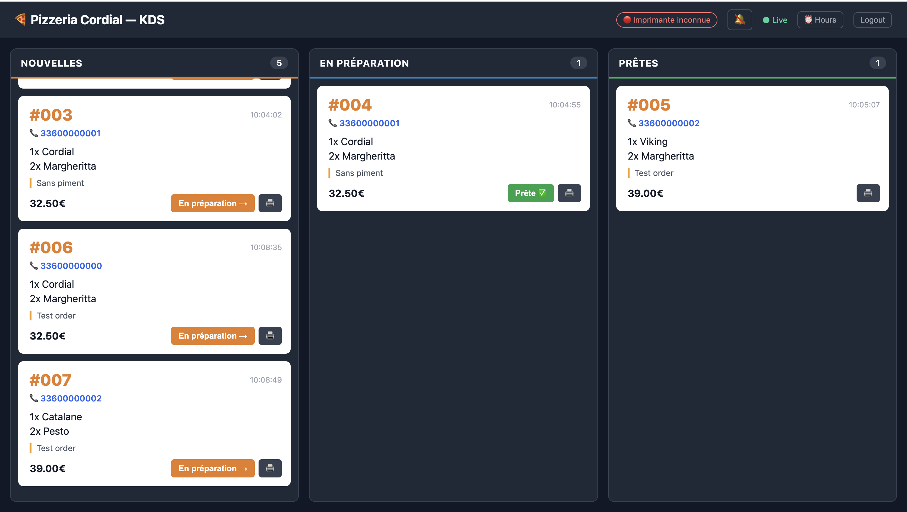
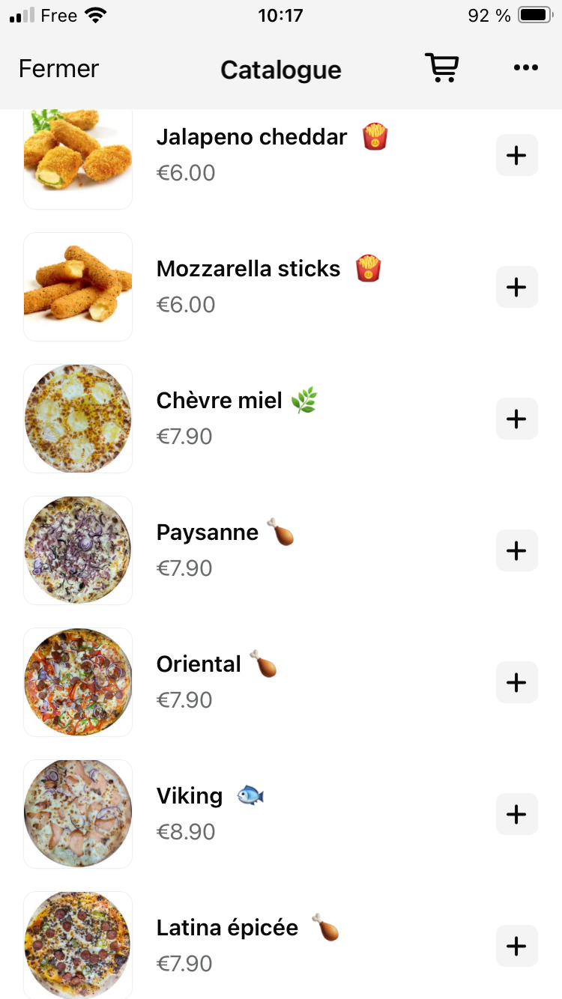
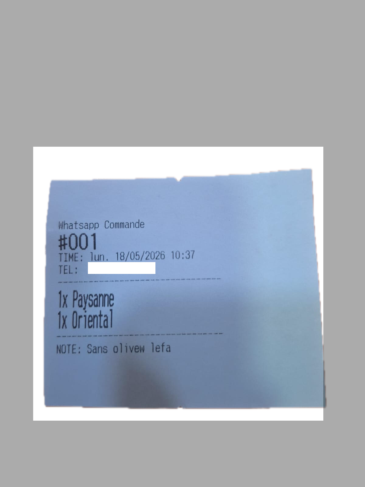

# 🍕 Restaurant KDS — Real-Time Kitchen Display System

A full-stack, production-deployed system that handles WhatsApp ordering, real-time kitchen display, and thermal receipt printing for a restaurant.

---

## Screenshots

### Dashboard (Desktop)


### Mobile




---

## Architecture



## Tech Stack

| Layer | Technology |
|---|---|
| **API Server** | Node.js, Express, Socket.io |
| **Database** | SQLite (better-sqlite3), JSON flat file |
| **Dashboard** | Vue 3, Vite, Pinia |
| **Messaging** | WhatsApp Cloud API (Meta) |
| **Printing** | ESC/POS over TCP, Raspberry Pi agent |
| **Deployment** | Docker, Docker Compose, Nginx, Let's Encrypt |
| **CI/CD** | GitHub Actions |
| **Testing** | Jest (server), Vitest + Vue Test Utils (dashboard) |
| **Linting** | ESLint, Prettier |

---

## Project Structure

```
restaurant-kds/
├── server/                  # Express API
│   ├── src/
│   │   ├── config/          # All env vars in one place
│   │   ├── routes/          # webhook, orders, printer
│   │   ├── services/        # Business logic (orders, WhatsApp, tickets, hours)
│   │   └── utils/           # Logger, order counter
│   └── tests/               # Jest unit tests
│
├── dashboard/               # Vue 3 frontend (KDS screen)
│   └── src/
│       ├── components/      # OrderCard, KdsColumn, PrinterStatus
│       └── stores/          # Pinia orders store + Socket.io
│
├── printer-worker/          # Raspberry Pi polling agent
│   └── src/
│       ├── index.js         # Poll → print → heartbeat loop
│       └── printer.js       # ESC/POS driver
│
├── nginx/                   # Reverse proxy + SSL config
├── Dockerfile               # Multi-stage build
├── docker-compose.yml       # Production
└── docker-compose.dev.yml   # Local development
```

---

## Key Features

- **Real-time order board** — three-column Kanban (New → Preparing → Ready) updated live via WebSocket
- **WhatsApp ordering** — customers order through the Meta Catalog; the bot handles confirmation, extras, and status updates
- **Opening hours guard** — orders rejected automatically outside service hours; configurable from the dashboard
- **Thermal printing** — ESC/POS commands sent over TCP to a networked receipt printer; the Pi worker retries on failure
- **Daily auto-reset** — orders and counter clear at 05:00 via cron
- **Printer status indicator** — dashboard shows online/offline based on heartbeat
- **JWT authentication** — dashboard protected by login

---

## Local Development

### Prerequisites
- Node.js ≥ 18

### 1. Clone and install

```bash
git clone https://github.com/YOUR_USERNAME/restaurant-kds.git
cd restaurant-kds
npm install
```

### 2. Configure environment

Create a `.env` file at the root:

```env
NODE_ENV=development
ADMIN_USERNAME=admin
ADMIN_PASSWORD=admin
JWT_SECRET=dev-secret
RESTAURANT_NAME=Your Restaurant

# WhatsApp (only needed for webhook testing)
FB_TOKEN=
PHONE_NUMBER_ID=
COMMENTS_FLOW_ID=
WEBHOOK_VERIFY_TOKEN=
```

### 3. Run

```bash
npm run dev          # starts server (port 3000) and dashboard (port 5173)
```

### 4. Seed test orders

```bash
curl -s -X POST http://localhost:3000/api/orders/test \
  -H "Content-Type: application/json" \
  -d '{"phone":"33600000001","note":"Sans piment"}'
```

---

## Testing

```bash
npm test                        # all tests
npm test --workspace=server     # server only (with coverage)
npm test --workspace=dashboard  # dashboard component tests
```

---

## Production Deployment

### Server setup

```bash
# 1. Install Docker
curl -fsSL https://get.docker.com | sh

# 2. Clone the repo
git clone https://github.com/YOUR_USERNAME/restaurant-kds.git /opt/restaurant-kds
cd /opt/restaurant-kds

# 3. Create environment file
nano .env   # see Environment Variables section below

# 4. Get SSL certificate
sudo certbot certonly --standalone -d your.domain.com \
  --email you@example.com --agree-tos --non-interactive

# 5. Configure host nginx (proxy to port 3001)
sudo nano /etc/nginx/sites-available/kds
sudo systemctl start nginx

# 6. Start containers
docker compose -f docker-compose.yml -f docker-compose.prod.yml up -d --build
```

### Subsequent deploys

Handled automatically by GitHub Actions on every push to `main`.

---

## Raspberry Pi Printer Worker Setup

```bash
# 1. Copy printer-worker to the Pi
scp -r printer-worker/ pi@192.168.1.XXX:/home/pi/kds/

# 2. Install dependencies
cd /home/pi/kds/printer-worker
npm install

# 3. Configure
cp .env.example .env
nano .env   # set SERVER_URL and PRINTER_IP

# 4. Install as a system service
sudo cp kds-printer.service /etc/systemd/system/
sudo systemctl enable kds-printer
sudo systemctl start kds-printer

# 5. Check logs
sudo journalctl -u kds-printer -f
```

---

## GitHub Actions CI/CD

Add these secrets to your GitHub repo (`Settings → Secrets → Actions`):

| Secret | Description |
|---|---|
| `PROD_HOST` | Your server IP |
| `PROD_USER` | SSH user |
| `PROD_SSH_KEY` | Private SSH key |

---

## Environment Variables

| Variable | Description |
|---|---|
| `RESTAURANT_NAME` | Your restaurant name (shown in WhatsApp messages and dashboard) |
| `FB_TOKEN` | Meta WhatsApp API bearer token |
| `PHONE_NUMBER_ID` | WhatsApp Business phone number ID |
| `COMMENTS_FLOW_ID` | Meta Flow ID for the order options screen |
| `WEBHOOK_VERIFY_TOKEN` | Token for Meta webhook verification |
| `FRONTEND_URL` | Dashboard URL (for CORS + Socket.io) |
| `ADMIN_USERNAME` | Dashboard login username (default: admin) |
| `ADMIN_PASSWORD` | Dashboard login password |
| `JWT_SECRET` | Secret for signing JWT tokens |
| `PORT` | Server port (default: 3000) |

---

## License

MIT
